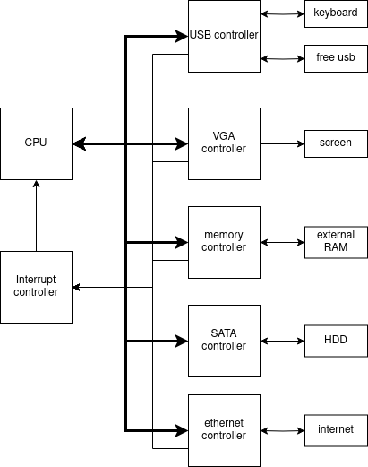

# MAYBE COMPUTER

The maybe computer is a personnal project that aims to make a fully functionnal computer with peripheral controllers on FPGAs.
The first version of the maybe computer should have access to USBs (for keyboard), VGA, external RAM, SATA (for Hard Disk Drive) and ethernet.

